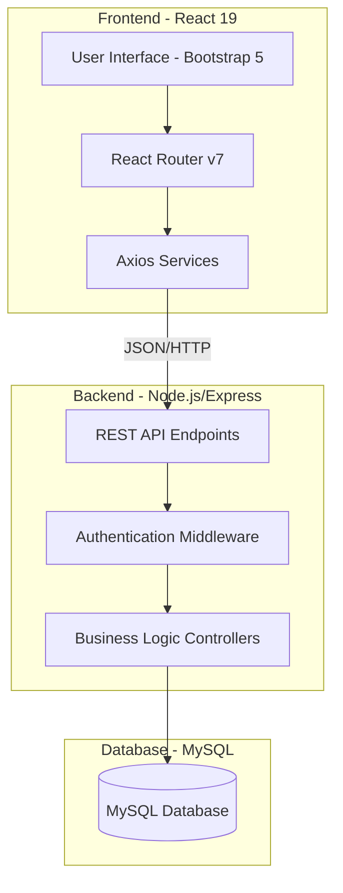
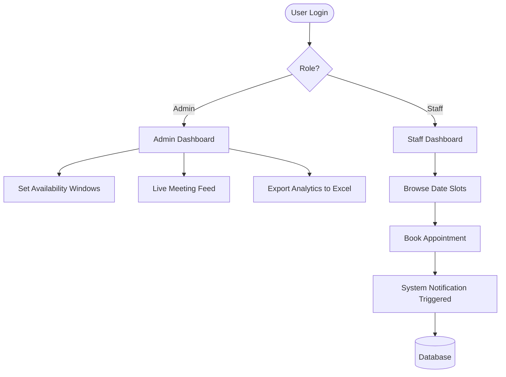
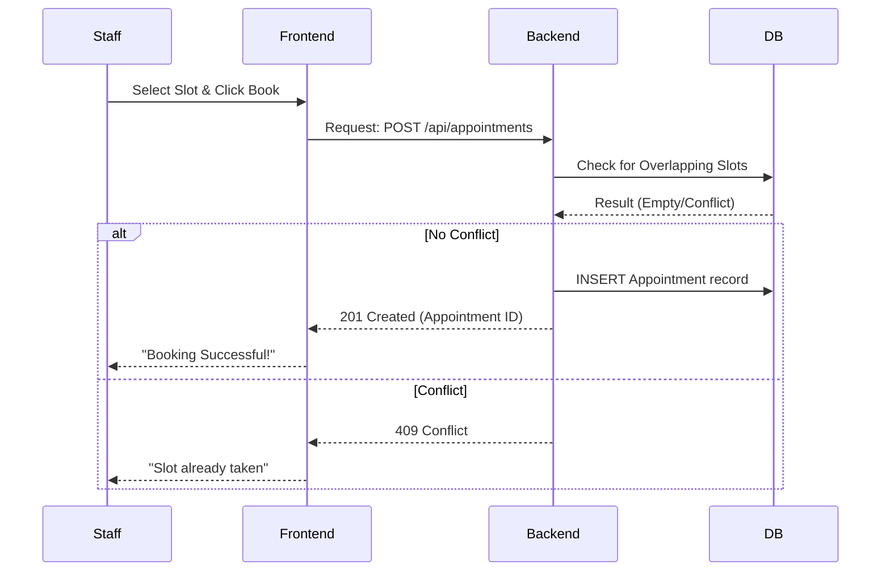
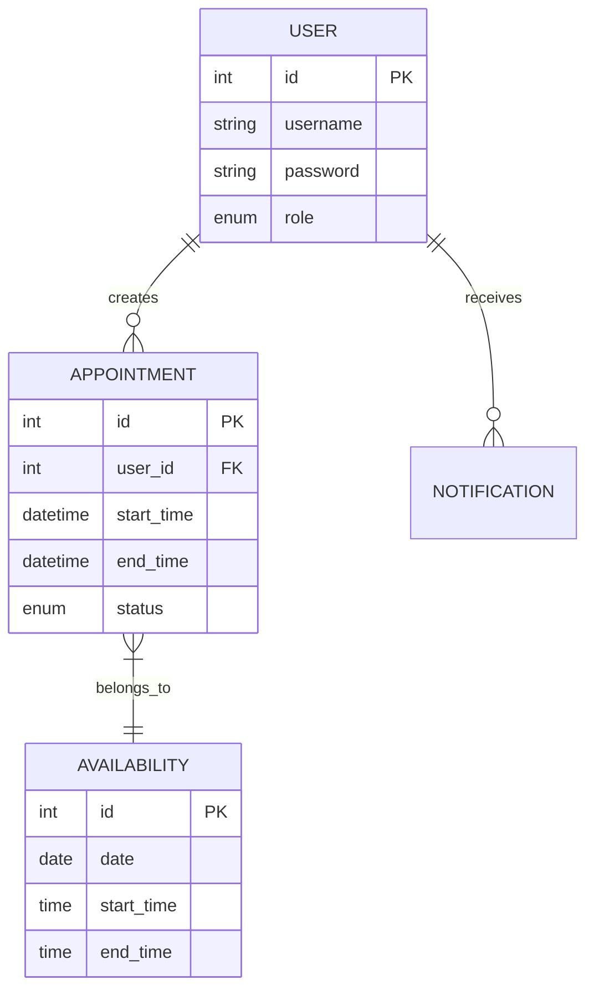
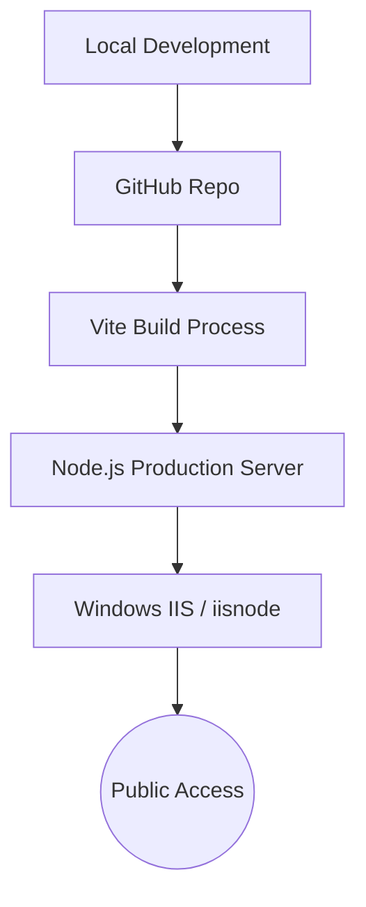

# PAS — Principal Appointment System

<div align="center">


**A professional, production-grade appointment management ecosystem for educational leadership.**

[Explore Features](#-features) • [Deployment Guide](#-installation--setup) • [Architecture](#-system-architecture) • [Optimization](#-project-optimization-sujhav-improvements)

</div>

---

## 📖 Overview

**PAS (Principal Appointment System)** is a high-performance full-stack web application designed to digitize and optimize the scheduling workflow between institutional stakeholders and the Principal. Built with modern web standards, it ensures transparency, eliminates double-booking, and provides administrators with strategic insights through real-time data visualization.

### 🌟 Real-World Importance

- **Operational Efficiency:** Transitions manual ledger-based booking into a seamless digital workflow.
- **Resource Optimization:** Reduces idle time for management by ensuring a structured daily schedule.
- **Data Integrity:** Maintains a tamper-proof audit trail of meetings and their actual durations.

---

## 🧠 System Architecture

### 📊 Architecture Diagram



### 🏗️ Explanation

- **Frontend:** A SPA (Single Page Application) built with React 19 and Vite for rapid rendering and state management.
- **Backend:** A RESTful Node.js environment utilizing Express for stateless request handling.
- **Security:** Layered access via `PrivateRoute` components and backend middleware validations.

---

## 🔄 Application Flow

### 📌 Flowchart



### 🔁 Sequence Diagram



---

## 🧩 Module Breakdown

- **Admin Module:** Centralized control for availability windows, live meeting status toggles, and multi-parameter report generation.
- **User Module:** Personalized dashboard for staff tracking their own request lifecycle and scheduling new slots.
- **Notification System:** Event-driven module alerts users on booking confirmations and status transitions.
- **Analytics Engine:** Backend logic calculates peak hour traffic and staff participation metrics.

---

## ✨ Features

- **✅ Intelligent Slot Validation:** Real-time checking against existing appointments and admin availability.
- **⏱️ Live Session Tracker:** Integrated stopwatch for "In-Progress" meetings on the Admin side.
- **📊 Strategic Insights:** Dashboards for "Portal Traffic," "Peak Hours," and "Load Factor" (30-day view).
- **📥 One-Click Export:** Seamless Excel (XLSX) generation for institutional reporting.
- **🛡️ RBAC Privacy:** Strict segregation of Admin and Staff data views.

---

## 🧰 Tech Stack

- **Frontend:** React 19, Vite 7, Bootstrap 5, Lucide React (Icons).
- **Backend:** Node.js, Express.js (ES Modules).
- **Database:** MySQL 8.0 (Managed via `mysql2/promise`).
- **Reporting:** `xlsx` library for institutional data portability.
- **Styling:** Custom CSS + Bootstrap Utility classes for high-performance UI.

---

## 📂 Project Structure

```text
PAS/
├── client/                 # React Application
│   ├── src/
│   │   ├── components/     # UI Components (Calendar, Layout, etc.)
│   │   ├── pages/          # Full-page views
│   │   └── services/       # API abstraction layer
├── server/                 # Express API
│   ├── controllers/        # Logical controllers
│   ├── routes/             # API Routing logic
│   ├── db.js               # Database connection pool
│   └── schema.sql          # Core DB structure
└── .env                    # Environment variables (Sensitive)
```

---

## ⚙️ Installation & Setup

### 🖥️ System Requirements

- **Node.js:** v18.x or higher
- **Database:** MySQL 8.0
- **Memory:** 4GB RAM minimum

### 🔧 Step-by-Step Setup

1. **Clone & Install:**

   ```bash
   git clone https://github.com/your-username/PAS.git
   cd PAS/server && npm install
   cd ../client && npm install
   ```

2. **Database Config:**
   - Execute `server/schema.sql` in your MySQL Workbench or CLI.
   - Configure `server/.env` with your DB credentials.

3. **Execution:**
   - **Backend:** `npm run dev` (from `/server`)
   - **Frontend:** `npm run dev` (from `/client`)

---

## 🔐 Security & Restrictions

- **Session Management:** Secure role-based filtering via `localStorage` and `AppRoutes` guards.
- **Environment Isolation:** Sensitive DB keys are strictly isolated in `.env`.
- **Validation:** Frontend and Backend dual-validation for time-slot integrity.

---

## 🗄️ Database Design

### 📊 ER Diagram



---

## 🧹 Project Optimization सुझाव (Improvements)

### 🚩 Recommended Cleanup

1. **Unused Utilities:** Remove or move `server/check_db.js`, `server/migrate.js`, and `server/fix_migration.js` into a dedicated `archive/` folder.
2. **Standardization:** Rename `client/src/components/ui/sonnar.jsx` to `sonner.jsx` to maintain consistency with the library name.
3. **Redundant SQL:** Consolidate `add_commitment_columns.sql` and `fix_db_access.sql` into the master `schema.sql` for a single-command setup.

### 🚀 Performance & Security Suggestions

- **Password Hashing:** Implement `bcryptjs` in `authController.js`. The current plain-text storage in `schema.sql` is for demo only.
- **Centralized Config:** utilize the `server/config/` folder for DB pool settings instead of `server/db.js` alone.
- **Caching:** Integrate `Redis` for availability slots if system load exceeds 1,000 daily users.

---

## 🚀 DevOps & Deployment

### ⚙️ Deployment Diagram



---

## 📜 License

This project is licensed under the MIT License - see the [LICENSE](LICENSE) file for details.

---

🎨 _Crafted for institutional excellence._
